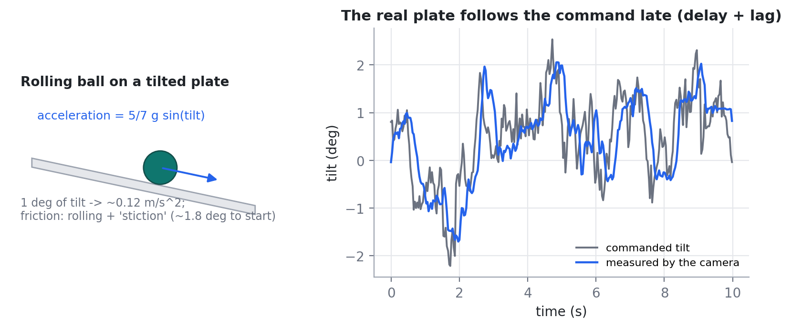
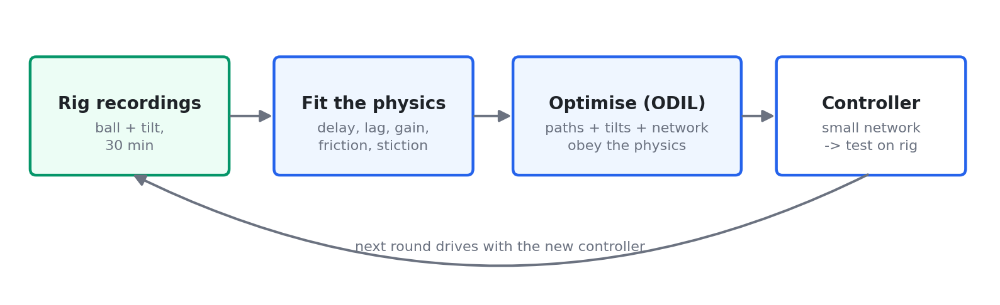
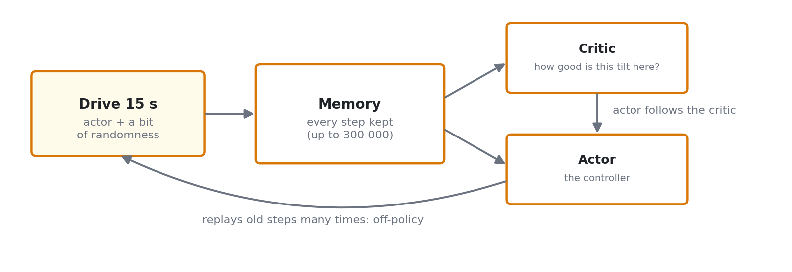
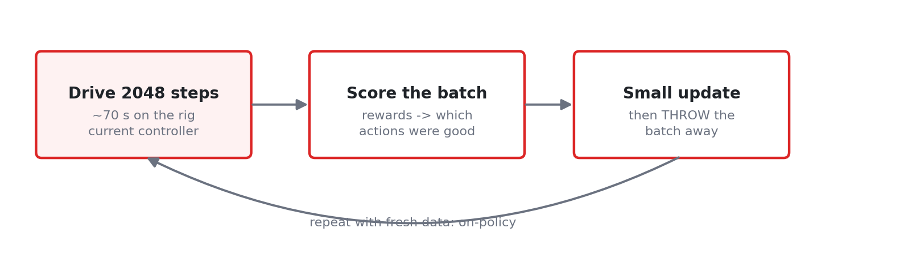
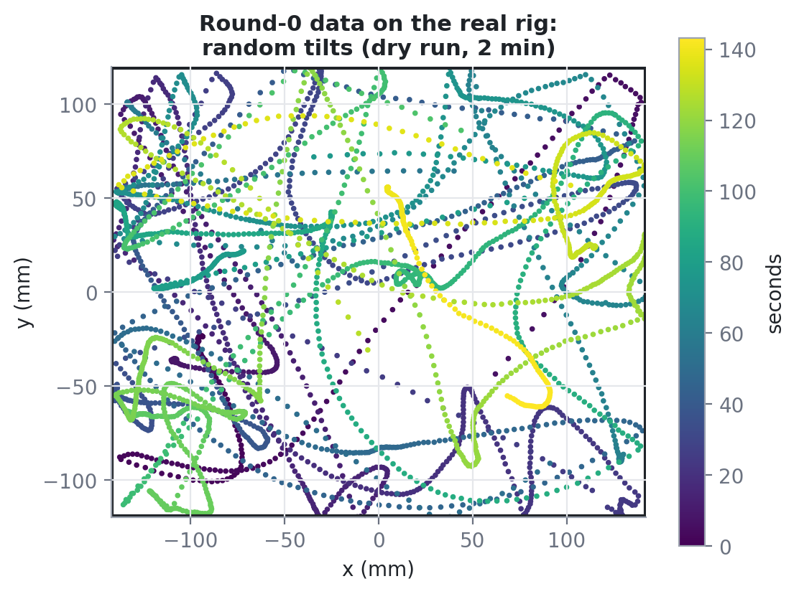
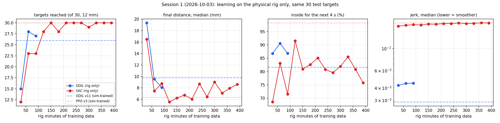

# Learning ball-on-plate control on a physical robot: ODIL vs. reinforcement learning

*CyberRunner rig, branch `ball-on-plate`. Status as of 2026-10-03 (session 1 of the rig-only
experiment, SAC still running). Author of the project: dimikoumou. This report collects the methods
with their full equations, the experimental protocol, every result so far, and what is still open.
Companion documents: [`../docs/ODIL_REPORT.md`](../docs/ODIL_REPORT.md) (parts 1–2: simulation →
rig, the real maze), [`README.md`](README.md) (how to run part 3), the visual guide
[`report/CyberRunner_ODIL_RL_visual_guide.pdf`](report/CyberRunner_ODIL_RL_visual_guide.pdf).*

---

## Contents

1. [Summary](#1-summary)
2. [The project in three parts](#2-the-project-in-three-parts)
3. [The rig](#3-the-rig)
4. [Physics model of the ball and plate](#4-physics-model-of-the-ball-and-plate)
5. [System identification from rig data](#5-system-identification-from-rig-data)
6. [ODIL: optimising a discrete loss](#6-odil-optimising-a-discrete-loss)
7. [Closed-loop refinement (path tracking)](#7-closed-loop-refinement-path-tracking)
8. [Reinforcement learning: the task as an MDP](#8-reinforcement-learning-the-task-as-an-mdp)
9. [Soft Actor-Critic (SAC)](#9-soft-actor-critic-sac)
10. [Proximal Policy Optimization (PPO)](#10-proximal-policy-optimization-ppo)
11. [Experimental protocol: learning only on the rig](#11-experimental-protocol-learning-only-on-the-rig)
12. [Results so far](#12-results-so-far)
13. [Follow-up experiments (queued)](#13-follow-up-experiments-queued)
14. [Safety engineering for unattended multi-day runs](#14-safety-engineering-for-unattended-multi-day-runs)
15. [Honest assessment and limitations](#15-honest-assessment-and-limitations)
16. [Code map](#16-code-map)
17. [References](#17-references)

---

## 1. Summary

A ball rolls on a plate that two motors can tilt. A camera tracks the ball and the plate. The
task: bring the ball to a target and keep it there, smoothly. This project compares two ways to
**learn** that controller:

- **ODIL** (*Optimizing a Discrete Loss*, from Petros Koumoutsakos' group). The physics
  equations are written as a loss function. Gradient descent then finds trajectories and a neural
  controller that obey the physics and reach the target. The gradient is exact, computed through
  the equations.
- **Reinforcement learning** (SAC and PPO). The controller learns by trial and error from a reward
  signal. It needs no model, but it needs much more experience.

**Main experiment (part 3):** both are trained **only from data recorded on the physical rig**,
with no hand-made simulator. They are compared by **how many minutes of real rig time** they need.

**Results after the first full session (2026-10-03):**

- **ODIL** reached 28/30 test targets after **60 rig minutes** of data. It is at least as good as an
  ODIL controller trained in a hand-made simulator, and holds the target better (91 % inside).
- **SAC** reached 28/30 after **120 rig minutes** and 30/30 after 150. In the end it is more
  precise: about 6–8 mm median final distance against ODIL's 8–9 mm.
- **ODIL moves the plate about 4× more smoothly** (jerk 0.0044 vs 0.018) at every point.
- So far: ODIL needs about half the rig time and is much smoother, while SAC learns faster on
  hardware than expected and ends more precise.
- Still to come:
  - PPO on the rig;
  - a 5 mm precision retest of every saved controller;
  - a **reuse test**: ODIL's rig data trains a *new* task (path tracking) with zero extra rig
    minutes.

## 2. The project in three parts

| Part | Question | Main result |
|---|---|---|
| 1. Simulation → rig | Train classic, RL (PPO) and ODIL controllers in a simulator, run them on the rig | ODIL as accurate as PPO, about 2.5× smoother (120 rig trips); ODIL path tracker halves the worst-case deviation of a classic line follower |
| 2. Real labyrinth | Follow the printed route of the real CyberRunner maze board | The rig completed the real maze 3 times (first: 100 % of the 1.93 m route in 172 s); typical run about 25 % |
| 3. Rig-only learning (this report) | How much real rig time do ODIL, SAC and PPO need when nothing comes from a hand-made simulator? | Session 1: see [§12](#12-results-so-far) |

Details of parts 1 and 2: [`../docs/ODIL_REPORT.md`](../docs/ODIL_REPORT.md).

## 3. The rig

- **Plate:** about 26 × 21.6 cm, white lined paper in two sheets. A tape seam joins them on the
  right, and a taped-over hole sits in the middle (see [§12.2](#122-a-surface-defect-the-taped-over-hole)).
- **Ball:** steel, about 1.3 cm in diameter.
- **Actuation:** two Dynamixel servo motors (IDs 1 and 3) tilt the plate about two axes. Both run
  in extended-position (multi-turn) mode.
- **Sensing:** one overhead camera at about 29 frames per second. It gives:
  - the ball position $\mathbf{p}$, from colour and shape detection;
  - the plate tilt $\boldsymbol{\theta}$, from the pose of 8 markers on the frame;
  - the velocity $\mathbf{v}_n = (\mathbf{p}_n - \mathbf{p}_{n-1})/(t_n - t_{n-1})$.
- **Control loop:** 29 Hz ($\Delta t \approx 1/29$ s). Commands are tilt angles of at most
  ±4°. A camera-closed tilt servo converts commanded angles into motor ticks:

$$
m_{n+1} = m_n + c\left[(\theta^{*}_{n} - \theta^{*}_{n-1}) + g\,(\theta^{*}_{n-D} - \hat{\theta}_n)\right], \qquad g = 0.15
$$

  Here $m$ is the motor position in ticks, $\theta^*$ the commanded angle, $\hat\theta$ the angle
  measured by the camera, $D$ the measured loop delay, and $c$ ticks per degree.
- **Compute:**
  - a 4-core Intel Mac runs the rig: camera, control, and SAC/PPO updates between episodes;
  - an M1 Max laptop was used for offline training (no GPU in either case).

## 4. Physics model of the ball and plate

**Rolling ball.** A solid ball rolling without slipping accelerates at $\tfrac{5}{7} g \sin\theta$.
For small angles, with $\theta$ in degrees and a small level bias $\mathbf{b}$:

$$
\ddot{\mathbf{p}} = \tfrac{5}{7}\, g\, \sin\boldsymbol{\theta} \;\approx\; k\,(\boldsymbol{\theta}+\mathbf{b}),
\qquad k = \tfrac{5}{7}\, g\, \tfrac{\pi}{180} \approx 0.12\ \mathrm{m\,s^{-2}\,deg^{-1}}
$$

**Friction: rolling friction plus stiction (a smooth Stribeck model).** A resting ball stays put
until the tilt exceeds a breakaway angle (about 1.5–2°). A moving ball feels a constant rolling
drag $a_r$. To keep this differentiable for ODIL, the switch between the two is smooth:

$$
\mathbf{a} = \mathbf{d} \;-\; w(\lVert\mathbf{v}\rVert)\, h(\lVert\mathbf{d}\rVert)\,\frac{\mathbf{d}}{\lVert\mathbf{d}\rVert}
\;-\; \bigl(1-w(\lVert\mathbf{v}\rVert)\bigr)\, a_r\, \frac{\mathbf{v}}{\lVert\mathbf{v}\rVert},
\qquad \mathbf{d} = k(\boldsymbol{\theta}+\mathbf{b})
$$

$$
w(s) = e^{-(s/v_s)^2},\qquad
h(x) = -\kappa \log\!\left(e^{-x/\kappa} + e^{-a_s/\kappa}\right) \approx \min(x,\, a_s)
$$

- $w$ goes from 1 when the ball is at rest to 0 when it moves, with $v_s = 1$ cm/s.
- $h$ is a smooth minimum: a resting ball's static friction cancels the drive up to
  $a_s = k\,\theta_{\text{breakaway}}$, and $\kappa = 0.02\,a_s$.
- Speeds are regularised, $\lVert\mathbf v\rVert \to \sqrt{\lVert\mathbf v\rVert^2 + \epsilon^2}$
  with $\epsilon = 4$ mm/s, to avoid division by zero.

**Plate dynamics: delay and lag.** The plate follows a command late. There is a pure delay of
$d$ control steps, and the servo responds like a first-order lag with time constant $\tau$:

$$
\dot{\boldsymbol{\theta}}(t) = \frac{\mathbf{u}(t - d\,\Delta t) - \boldsymbol{\theta}(t)}{\tau},
\qquad d \in \{1,2,3\},\ \tau \approx 0.03\text{–}0.1\ \mathrm{s}
$$

In the ODIL model the delay is represented by a **chain of $N$ first-order stages** (3 in the
rig-only experiment), $\dot\theta_1 = (u-\theta_1)/\tau_1$ and $\dot\theta_j = (\theta_{j-1}-\theta_j)/\tau_j$.
The ball sees the last stage, $\theta_N$. The $\tau_j$ are randomised per trajectory, so the
controller is robust to the true, uncertain delay.

## 5. System identification from rig data

`rl_sim/sysid_rig.py` fits the model to logged rig data, i.e. measured positions, velocities,
tilts and commands:

$$
\hat{k},\,\hat{a}_r = \arg\min_{k,\,a_r}\ \sum_n \left\lVert \mathbf{a}^{\mathrm{meas}}_n - k\,\boldsymbol{\theta}_n
+ a_r \frac{\mathbf{v}_n}{\lVert\mathbf{v}_n\rVert} \right\rVert^2,
\qquad
\hat{d},\,\hat{\tau} = \arg\min_{d,\tau} \sum_n \left( \theta^{\mathrm{meas}}_n - \theta^{\mathrm{model}}_n(u;\, d, \tau) \right)^2
$$

The breakaway angle is estimated as the tilt at which resting balls start to move. Fits from the
rig-only ODIL rounds (session 1):

| Data | $k$ (m/s² per °) | $a_r$ (m/s²) | $\tau$ x / y (s) | Breakaway (°) |
|---|---|---|---|---|
| 30 rig min (random tilts) | 0.100 | 0.040 | 0.103 / 0.042 | 1.47 |
| 60 rig min | 0.097 | 0.037 | 0.103 / 0.042 | 1.95 |
| 90 rig min | 0.096 | 0.037 | 0.103 / 0.042 | 1.61 |

The values are consistent with earlier, independent fits ($k$ 0.095–0.113, $a_r$ 0.033–0.047).
The theoretical $k \approx 0.12$ is a little higher, as expected with real rolling losses.

## 6. ODIL: optimising a discrete loss

### 6.1 The idea

ODIL comes from Koumoutsakos' group (Karnakov, Litvinov, Koumoutsakos). The control version we
follow is "Optimal Navigation in Microfluidics via the Optimization of a Discrete Loss"
(arXiv 2506.15902). Instead of simulating forward and estimating gradients from sampled outcomes
(as RL does), it writes **many trajectories** with all their time points as **unknowns**. It then
minimises one loss over all of them **together with the weights $\phi$ of a closed-loop neural
policy** $\pi_\phi$. The physics enters as a penalty on the discretised equations (midpoint rule).

Generic form (our implementation; the smoothness and rest terms are our additions):

$$
L(\mathbf{x}, \phi) = \sum_n \left\lVert \mathbf{x}^{n+1} - \mathbf{x}^{n} - f\!\left(\mathbf{x}^{n+\frac{1}{2}},\, \pi_\phi(\mathbf{x}^{n+\frac{1}{2}})\right)\Delta t \right\rVert^2
\;+\; \lambda\, T \;+\; \mu \sum_n \left\lVert \mathbf{u}^{n+1}-\mathbf{u}^{n}\right\rVert^2 \;+\; \dots
$$

$$
(\mathbf{x}, T, \phi) \;\leftarrow\; (\mathbf{x}, T, \phi) - \eta\, \nabla L
\qquad \text{(all states, the durations and the policy network together)}
$$

Because the commands are produced *by the policy inside the physics residual*, the network learns
to produce the motions that the optimiser finds. The gradient is exact, through the equations.

### 6.2 The version used on the rig (`rl_sim/odil_plate_v9.py`, 3 delay stages)

**State** of each trajectory point (16 numbers with $N=3$):

$$
\mathbf{x} = \bigl[\ \mathbf{p},\ \mathbf{v},\ \boldsymbol\theta_1, \dots, \boldsymbol\theta_N,\ \mathbf{o}_1, \mathbf{o}_2,\ \mathbf{z}\ \bigr]
$$

- $\boldsymbol\theta_{1..N}$: the true tilt chain.
- $\mathbf{o}_1, \mathbf{o}_2$: a two-stage observer of the command (what the policy can know about
  the plate's state), $\dot{\mathbf o}_1 = (\mathbf u - \mathbf o_1)/\tau_o$ and
  $\dot{\mathbf o}_2 = (\mathbf o_1 - \mathbf o_2)/\tau_o$, with $\tau_o = 45$ ms.
- $\mathbf{z}$: a **leaky integral of the goal error**, which removes steady offsets
  (e.g. from a level bias):

$$
\dot{\mathbf z} = \frac{\mathbf g - \mathbf p}{z_s} - \frac{\mathbf z}{T_z}, \qquad z_s = 2\ \text{cm},\ T_z = 1.5\ \text{s}
$$

**Dynamics** $f$: $\dot{\mathbf p} = \mathbf v$; $\dot{\mathbf v}$ from §4 with the per-trajectory
hidden physics. For each trajectory these are drawn at random:
- $k \sim U(0.9\hat k, 1.1\hat k)$;
- breakaway angle $\sim U(0.7, 1.3)\times$ the fitted value;
- level bias $\lVert\mathbf b\rVert \le 0.8°$;
- stage time constants $\tau_j \sim U(0.7\min\hat\tau,\ 1.3\max\hat\tau)$.

**Policy** $\pi_\phi$: an MLP with 11 inputs, two hidden layers of 128 tanh units, and 2 outputs:

$$
\mathbf u = 4°\cdot\tanh\!\Bigl(\mathrm{MLP}_\phi\Bigl[\tfrac{\mathbf g-\mathbf p}{0.1},\ \tfrac{\mathbf v}{0.1},\ \tfrac{\mathbf o_1}{5},\ \tfrac{\mathbf o_2}{5},\ \mathbf z,\ \tfrac{R}{0.03}\Bigr]\Bigr)
$$

$R$ is the target radius, drawn per trajectory as $R \sim U(8, 30)$ mm.

**Trajectories:**
- $M = 768$ start–target pairs, each with $N_{\text{pts}} = 41$ time points.
- Unknown duration $T \in [0.3, 3]$ s, so $\Delta t = T/40$.
- 40 % start near the target (within 3 cm); a quarter of those start inside it.
- Boundary conditions: the start is at rest on a level plate. The **end is a true rest at the
  target centre**: velocity 0, and every tilt stage and observer equals the policy's own command there.

**Loss actually minimised:**

$$
L = 100\sum_{n}\left\lVert \frac{\mathbf{x}^{n+1}-\mathbf{x}^{n}-f(\mathbf{x}^{n+\frac12},\pi_\phi(\mathbf{x}^{n+\frac12}))\,\Delta t}{\mathbf s}\right\rVert^2
+ \lambda\, w_T\, T
+ \mu \sum_n \left\lVert\frac{\mathbf u^{n+1}-\mathbf u^n}{u_{\max}}\right\rVert^2
+ 10 \left\lVert \frac{\pi_\phi(\mathbf x^{\text{end}}) - \boldsymbol\theta^{\text{end}}_{1..N},\,\mathbf o^{\text{end}}}{u_{\max}}\right\rVert^2
+ 10 \left(\frac{\lVert\mathbf e\rVert}{5\ \text{mm}}\right)^{2}
$$

- First term: the physics residual, per-component scaled by $\mathbf s$.
- Second term: travel time, with $w_T = 0.2$ for near starts and 1 otherwise.
- Third term: smoothness, with $\mu = 0.02$.
- Fourth term: "true rest" at the end.
- Fifth term: offset $\mathbf e$ of the end point from the target centre (`ODIL_END_FREE` = 0).
- Optimisation: Adam with learning rate $10^{-3}$ for $\phi$ and $3\cdot10^{-3}$ for the
  trajectories and durations; 6 stages, with $\lambda$ starting at 0.2 and multiplied by 0.7 per
  stage. About 12 minutes on the 4-core Intel Mac.

### 6.3 Stiction compensation on the rig (`rl_sim/odil_friction_comp.py`)

ODIL controllers are deliberately gentle, because of the smoothness and delay robustness, and a
gentle tilt cannot always free a resting ball. On the rig the network is therefore combined with a
classic **breakaway boost**:

- If the ball has moved less than 1.5 mm over the last 12 frames (about 0.4 s) **and** is farther
  than $R$ from the target, an extra tilt toward the target ramps up at 6°/s, up to 2°.
- The boost is removed as soon as the ball moves.

This add-on is not part of ODIL. It is reported separately, and an ablation with and without it
is planned.

## 7. Closed-loop refinement (path tracking)

For path tracking (drawing shapes, following the maze line) the target is a **moving reference**
$\mathbf r(t)$. ODIL (`rl_sim/odil_track.py`) is trained on many short reference pieces (arcs,
lines, corners, waves at 1–4 cm/s) with a tracking term $\lambda\sum_n\lVert\mathbf p^n-\mathbf r^n\rVert^2$.

An ODIL policy fits its own optimised trajectories but has never seen its own compounding errors.
It is therefore refined by **backpropagation through closed-loop rollouts** in the differentiable
model, with delay, lag, camera noise, rate limit and friction (`rl_sim/finetune_track.py`):

$$
J(\phi) = \mathbb{E}\left[ \sum_n \left(\frac{\lVert\mathbf{p}_n - \mathbf{r}_n\rVert}{5\,\mathrm{mm}}\right)^{2}
+ w_j \lVert \Delta \mathbf{a}_n\rVert^2 + w_e \left\lVert \frac{\mathbf{u}_n - \ddot{\mathbf{r}}_n/k}{u_{\max}} \right\rVert^2 \right],
\quad \mathbf{u}_n = \pi_\phi(\mathrm{obs}_n),\ \ \mathbf{p}_{n+1} = \mathrm{sim}(\mathbf{p}_n, \mathbf{u}_n)
$$

- Batch: 96 rollouts of 120 control steps, each with 4 physics sub-steps.
- Gradients flow back through time from the end of every rollout.
- $w_j = 20$; the effort term $w_e$ is used only in the maze version.

## 8. Reinforcement learning: the task as an MDP

Both SAC and PPO use exactly the same interface as the simulated RL of part 1
(`rl_sim/plate_goal_env.py`).

**Observation** (17 numbers): goal error, velocity, position, measured tilt, target radius, and
the last 4 applied actions:

$$
\mathbf s = \Bigl[\tfrac{\mathbf g-\mathbf p}{0.1},\ \tfrac{\mathbf v}{0.1},\ \tfrac{\mathbf p}{0.14},\ \tfrac{\boldsymbol\theta}{5°},\ \tfrac{R}{0.03},\ \mathbf a_{t-1},\dots,\mathbf a_{t-4}\Bigr]
$$

**Action.** $\mathbf a\in[-1,1]^2$, scaled and **rate-limited**, so it cannot shake the plate:

$$
\mathbf a^{\text{applied}}_t = \mathrm{clip}\bigl(0.8\,\mathbf a_t,\ \mathbf a^{\text{applied}}_{t-1} - 0.1,\ \mathbf a^{\text{applied}}_{t-1} + 0.1\bigr),
\qquad \boldsymbol\theta^* = 5°\cdot \mathbf a^{\text{applied}}_t\ (\le 4°)
$$

**Reward** per step, with $d_t$ the distance to the target and $R$ its radius:

$$
r_t = -\frac{d_t}{0.1\,\mathrm{m}} + \mathbf{1}[d_t < R] + 0.5\,\mathbf{1}\bigl[d_t<R \wedge \lVert\mathbf{v}_t\rVert<1\,\mathrm{cm/s}\bigr]
- 0.3\,\lVert\mathbf{a}_t - \mathbf{a}_{t-1}\rVert^2 - 0.01\,\lVert\mathbf{a}_t\rVert^2 - 0.5\,\mathbf{1}[\text{at frame}]
$$

"At frame" means $|x| > 13$ cm or $|y| > 10.8$ cm.

**Episodes:** 450 steps (about 15.5 s), with a new random target and radius $R\sim U(8,30)$ mm per
episode. Both learn to maximise the discounted return:

$$
G_t = \sum_{l=0}^{\infty} \gamma^{l}\, r_{t+l},\qquad \gamma = 0.99
$$

## 9. Soft Actor-Critic (SAC)

SAC (Haarnoja et al., 2018) is **off-policy** and **maximum-entropy**. It keeps every transition
in a replay memory $\mathcal D$ and reuses it many times. That makes it the most data-efficient
standard model-free method, and a natural choice for real hardware.

**Objective** (reward plus an entropy bonus that keeps it exploring):

$$
J(\pi) = \mathbb{E}\left[ \sum_t \gamma^t \bigl( r_t + \alpha\, \mathcal{H}(\pi(\cdot|s_t)) \bigr) \right],
\qquad \mathcal{H} = -\mathbb{E}_{a\sim\pi}[\log \pi(a|s)]
$$

**Critics:** two Q-networks with slowly-updated target copies $\bar Q_i$ (Polyak $\tau = 0.005$):

$$
L_Q = \mathbb{E}_{(s,a,r,s')\sim\mathcal{D}}\left[ \Bigl( Q(s,a) - r - \gamma \bigl( \min_{i=1,2} \bar{Q}_i(s',a') - \alpha \log\pi(a'|s') \bigr) \Bigr)^2 \right],\quad a'\sim\pi(\cdot|s')
$$

**Actor:** a squashed Gaussian, trained to pick actions the critics rate highly while staying random:

$$
L_\pi = \mathbb{E}_{s\sim\mathcal{D},\ a\sim\pi}\left[ \alpha\,\log\pi(a|s) - \min_{i=1,2} Q_i(s,a) \right]
$$

$\alpha$ is tuned automatically toward a target entropy (stable-baselines3 default).

**Settings on the rig:**
- Networks: 256 × 256; learning rate $3\cdot 10^{-4}$; replay buffer 300 000; batch 256.
- 5 000 random steps before learning starts.
- **Network updates happen between episodes, with the plate held level**: `train_freq` = 1
  episode, as many gradient steps as environment steps. The 29 Hz control loop is therefore never
  slowed by training. As a result, 30 rig minutes take about 43 minutes of wall-clock time.

## 10. Proximal Policy Optimization (PPO)

PPO (Schulman et al., 2017) is **on-policy**. It collects a fresh batch with the current policy,
improves the policy a little, and discards the batch. It is robust and widely used, but needs much
more data than SAC. It was the method behind the part-1 sim-trained controller (PPO v3).

**Clipped surrogate objective:**

$$
L^{\mathrm{CLIP}}(\phi) = \mathbb{E}_t\left[ \min\!\left( \rho_t \hat{A}_t,\ \mathrm{clip}(\rho_t,\, 1-\epsilon,\, 1+\epsilon)\,\hat{A}_t \right)\right],
\qquad \rho_t = \frac{\pi_\phi(a_t|s_t)}{\pi_{\phi_{\mathrm{old}}}(a_t|s_t)},\quad \epsilon = 0.2
$$

**Advantages** by generalised advantage estimation, with a learned value function $V$:

$$
\hat{A}_t = \sum_{l\geq 0} (\gamma\lambda)^l\, \delta_{t+l},\qquad \delta_t = r_t + \gamma V(s_{t+1}) - V(s_t),\qquad \lambda = 0.95
$$

**Settings** (identical to the simulated PPO, one rig instead of 8 simulators): 2048 steps per
update, minibatch 64, 10 epochs, learning rate $3\cdot10^{-4}$, networks 256 × 256.

## 11. Experimental protocol: learning only on the rig

Script: [`rig_learn.py`](rig_learn.py), which runs unattended for days. Every result is logged with
the **rig minutes of training data** behind it (`phase3_logs/rig_learn.jsonl`). Every frame is
recorded (`physical_training/data/`).

### 11.1 ODIL arm (3 rounds × 30 min)

1. **Round 0: random tilts, no prior controller.** A smooth random signal (Ornstein–Uhlenbeck
   process) with a pull back from the frame and a speed brake:

$$
\mathbf u_{n+1} = \mathbf u_n - \frac{\mathbf u_n\,\Delta t}{1.5\,\text{s}} + 0.2\sqrt{\Delta t}\ \boldsymbol\xi_n,\qquad \boldsymbol\xi_n\sim\mathcal N(0, I)
$$

$$
\mathbf a = \mathrm{clip}\Bigl(\mathbf u + \mathrm{clip}\bigl(-4\,\mathrm{sign}(\mathbf p)\max(|\mathbf p| - \mathbf c, 0),\ \pm0.3\bigr) + \mathbf b_{\text{brake}},\ \pm 0.35\Bigr)
$$

   - $\mathbf c$ = (7, 5.5) cm.
   - In a corner the ball is sent away decisively.
   - The brake acts above 15 cm/s.

2. **Fit** the physics to all rig data so far (§5).
3. **Train ODIL** in the fitted model (§6), about 12 min of computing.
4. **Test** on the 30 fixed targets.
5. **Next round:** drive 30 min with the new ODIL controller to random targets (a new one every
   6 s), then repeat steps 2–4 with all the data.

### 11.2 RL arms

- **SAC:** from scratch, up to 10 h of driving, tested every 30 rig minutes. Checkpoints saved at
  every test.
- **PPO:** from scratch, up to 30 h, tested every 60 rig minutes.

### 11.3 The test (identical for every controller)

- **30 fixed targets** (seed 2027) within ±9 cm × ±7 cm, at least 5 cm from the frame. The
  controller is told $R$ = 12 mm.
- Each trip starts wherever the ball is. A target is **reached** if the ball comes within $R$
  within 8 s; it is then observed for 4 more seconds.
- Metrics per trip: reached; time to reach; final distance; closest approach; times to within
  5/10/15/20/30 mm; and

$$
\text{inside} = \frac{1}{4\,\text{s}}\int_{t_{\text{in}}}^{t_{\text{in}}+4\,\text{s}} \mathbf{1}[d(t) < R]\,dt,
\qquad
\text{jerk} = \frac{1}{N}\sum_n \lVert\mathbf{a}_n - \mathbf{a}_{n-1}\rVert^2
$$

- **References in every session:** the part-1 controllers trained in simulation (ODIL v11, PPO v3)
  on the same targets. They anchor each session against rig drift.
- **Fairness:** same targets, same observation and limits for the RL arms, and the order of methods
  alternates across sessions. Tests are recorded frame by frame, so any tolerance can be evaluated
  afterwards.

## 12. Results so far

### 12.1 Session 1 (2026-10-03, plate levelled with the camera, start 01:18)

| Controller | Rig data | Reached (12 mm) | Within 10 mm | Time to reach | Inside after | Final dist. (median) | Final < 5 mm | Final < 8 mm | Jerk |
|---|---|---|---|---|---|---|---|---|---|
| ODIL v11, sim-trained (reference) | 0 | 26/30 | | 2.6 s | 82 % | 9.8 mm | | | 0.0029 |
| PPO v3, sim-trained (reference) | 0 | 30/30 | | 1.3 s | 98 % | 6.4 mm | | | 0.0182 |
| **ODIL, rig only** | 30 min | 15/30 | 15/30 | 2.2 s | 87 % | 19.4 mm | 3 % | 30 % | 0.0042 |
| | **60 min** | **28/30** | **28/30** | 2.9 s | **91 %** | 9.5 mm | 23 % | 37 % | 0.0044 |
| | 90 min | 27/30 | 27/30 | 2.6 s | 87 % | 8.1 mm | 7 % | 50 % | 0.0045 |
| **SAC, rig only** | 30 min | 12/30 | 12/30 | 1.6 s | 69 % | 16.5 mm | 7 % | 17 % | 0.0169 |
| | 60 min | 23/30 | 22/30 | 1.3 s | 83 % | 7.5 mm | 21 % | 50 % | 0.0172 |
| | 90 min | 23/30 | 23/30 | 1.3 s | 72 % | 8.8 mm | 0 % | 45 % | 0.0175 |
| | **120 min** | **28/30** | **28/30** | 1.2 s | **92 %** | **5.5 mm** | 37 % | 73 % | 0.0173 |
| | 150 min | 30/30 | 30/30 | 1.1 s | 81 % | 6.2 mm | 30 % | 67 % | 0.0177 |
| | 180 min | 28/30 | 28/30 | 1.5 s | 83 % | 6.8 mm | 33 % | 60 % | 0.0177 |
| | 210 min | 30/30 | 30/30 | 1.3 s | 85 % | 6.0 mm | 33 % | 73 % | 0.0179 |
| | 240 min | 30/30 | 27/30 | 1.3 s | 81 % | 8.7 mm | 20 % | 40 % | 0.0179 |
| | 270 min | 30/30 | 29/30 | 1.2 s | 80 % | 6.5 mm | 40 % | 57 % | 0.0182 |
| | 300 min | 29/30 | 29/30 | 1.3 s | 82 % | 9.0 mm | 20 % | 37 % | 0.0179 |
| | 330 min | 30/30 | 30/30 | 1.4 s | 86 % | 7.1 mm | 30 % | 60 % | 0.0180 |
| | 360 min | 30/30 | 29/30 | 1.4 s | 81 % | 7.9 mm | 20 % | 50 % | 0.0182 |
| | 390 min | 30/30 | 30/30 | 1.3 s | 76 % | 8.6 mm | 17 % | 43 % | 0.0182 |

*(SAC continues to 600 rig minutes. Balls lost off the plate during tests: SAC 1, 2 and 1 at 30, 60 and 90 min, none afterwards; ODIL none. No safety stop occurred in this session.)*

**Reading:**
- **Rig time to a good controller:** ODIL 60 min, SAC about 120 min (28/30 in both cases). That's
  a factor of about 2, smaller than the factor of more than 10 seen against PPO in simulation.
  SAC is far more data-efficient than PPO.
- **Smoothness:** ODIL's jerk is about 4× lower throughout. That's ODIL's clearest advantage.
- **Precision and speed:** SAC reaches targets about 2× faster (1.2–1.4 s vs 2.2–2.9 s) and ends
  closer to the centre.
- **SAC after its peak:** it has stayed on a plateau since about 150 min. Holding has slipped
  slightly at 240–390 min (76–86 % inside, 7–9 mm). Whether that is a real decline is open until
  the full 600 minutes.
- **Both rig-only ODIL rounds after the first match or beat the sim-trained ODIL** (26/30, 9.8 mm).
  Learning only from the rig did not cost quality.

### 12.2 A surface defect: the taped-over hole

In ODIL's first test (30 rig min) the ball sat for about 80 s at the plate centre, at (13, −12) mm,
where the hole is covered by tape. It moved only a few millimetres despite commanded tilts up to
3.4°. The tape probably forms a slight dip. All 11 failures before the ball escaped came from this
one spot. After it escaped, ODIL reached 15 of the remaining 19 targets, mostly within 1–5 mm.

- **Why it matters:** the fitted model assumes uniform friction, and 30 min of random driving
  rarely visits that exact spot. A local defect is invisible to a global physics fit.
- **RL, by contrast,** can learn local effects implicitly.
- Every method meets the same surface and targets. With the frame-by-frame recordings, trips that
  start in the dip can be marked and evaluated separately.

### 12.3 Target size and the precision gap

At a 12 mm target radius (about two ball widths) many controllers look similar on "reached". The
stricter tolerances above show that the gap at the end is real: From 120 rig minutes on SAC ends below 5 mm
in 17–40 % of trips, ODIL in 3–23 %.

**Why (corrected 2026-10-03):** the rig ODIL itself is trained to stop at the exact centre. But its
stiction compensation (§6.3) only pushes a resting ball that is **farther than $R$** from the target.
With $R$ = 12 mm, a ball stuck 8 mm off gets no more push, and ODIL's gentle tilts stay below the
breakaway angle. SAC's reward pulls toward the centre at every step ($-d/0.1$), and its tilts are
sharper. An earlier explanation (that ODIL is trained to rest anywhere within $R/2$) applied only to
ODIL v7, not to the version used here.

## 13. Follow-up experiments (queued)

| Order | Experiment | Rig time | Purpose |
|---|---|---|---|
| 1 | SAC to 600 rig minutes (session 1) | ~4 h left | complete, uncut curve; long-run stability |
| 2 | References, then **PPO from scratch** for up to 30 h | ~30 h | the on-policy curve; the largest expected gap to ODIL |
| 3 | **5 mm retest** of every saved controller | ~3 h | precision when every controller is *told* 5 mm (ODIL's breakaway boost then acts until 5 mm) |
| 4 | **Reuse test**: ODIL path tracker trained only from the 90 min of ODIL rig data | 0 for training, ~15 min to test | "learn the physics once, solve new tasks" |
| 5 | SAC learning path tracking on the rig, for comparison | measured | how much rig time RL needs for the new task |
| later | sessions 2–3 (orders `ref,sac,odil`, `ref,odil,sac`), PPO trained in the fitted model offline, ablation without stiction compensation | | repeats, separating "having a model" from "how it is optimised" |

**Reuse test, status:** the tracker has been trained on the M1 Max from the 3 ODIL rig recordings
only (`reuse_tracker.py`: fit → ODIL tracking → closed-loop refinement). In the fitted model it
stays a median of **4.5 mm** from the path. It is committed as
`rl_sim/runs/reuse_odil1_track/odil_track_policy.npz` and will be tested on the rig (circle, square,
star) after PPO. Its rig minutes spent learning the task are **zero**. For comparison, the
sim-trained ODIL tracker of part 1 achieved a median of 3.6 mm and a worst case of 19 mm on the rig.

## 13a. Protocol changes during the experiment (log for the paper)

Every change to the rig software after session 1 started, why, and which runs it affects. **Runs are
only compared directly when they used the same code**: session 1 (ODIL, SAC) predates the changes
below; PPO and every later session use all of them. Session 2 (ODIL and SAC again, order swapped)
therefore runs on the final code, so that ODIL, SAC and PPO are compared under identical conditions;
session 1 is reported as the first run.

| Date / time | Change (commit) | Reason | Affects |
|---|---|---|---|
| 10-03 16:30 | **Marker guard**: ball within 4.5 cm of a plate marker -> that frame's plate pose is not used (`db8ec17`) | SAC at ~530 rig min rolled the ball onto a marker; the bluish ball was taken for the marker, the tilt reading was 2-10 deg wrong and the servo drove the motors ~1000 ticks; session 1 stopped by hand at 510 rig min of SAC | all runs after session 1 |
| 10-03 16:30 | **Corner shield**: within 6 cm of a marker every controller's action is replaced by a tilt towards the middle (`db8ec17`); ramps 1.4 -> 3.2 deg (`7743a5b`) | same; PPO left a ball resting in a corner for 263 s at a constant 1.4 deg | all runs after session 1 (SAC session 1: ball in that zone 0.6 % of frames) |
| 10-03 16:45 | **Frozen test targets** (`data/test_targets.json`, `7e022c2`) | a hole detected at a later start would have shifted the seeded target draw | none (identical to session 1's targets, checked on all 20 tests) |
| 10-03 18:30 | **Ball jump filter follows a rolling ball** when re-acquiring (`8e73b50`) | the old rule never re-acquired a moving ball: untrained PPO saw the ball only 58-80 % of the time (SAC's random phase 98-100 %) | all runs after session 1; SAC/ODIL in session 1 were hardly affected (98-100 % found) |
| 10-03 21:50 | **Camera re-level pauses** instead of a watchdog stop, user-approved (`58e5882`) | PPO's hard tilting wound the commanded motor ticks up (motors 340-470 ticks short of the command); the 1300-tick watchdog stopped PPO after 26 min although the camera showed the plate following | runs with hard tilting (PPO); logged as `relevel` events |
| 10-03 23:30 | **Ball tracking at high speed**: a missed frame no longer resets position/time/speed; after re-acquiring, the velocity comes from the followed candidate (<= 40 mm/frame); speeds above 1 m/s are clamped as glitches; jump allowance window capped at 0.3 s | PPO's first test (60 rig min) lost the ball mid-plate in all 30 trips: at full tilt the ball exceeded 0.6 m/s and each miss reset the speed to 0, so the next frame was rejected again | all runs from PPO's 4th start on; a 1-min full-tilt check saw the ball 91.6 % of the time |
| 10-03 | `--sac-buffer` default 1 M (session 1: 300 k) (`0bbb493`) | test whether SAC's decline came from FIFO replay forgetting | SAC session 2 |

**Note on motor 3 (2026-10-03, 23:17-23:20):** two 1-minute stress checks of the tracking with instantaneous +-4 deg flips on both axes (no rate limit -- much harsher than any controller, which change at most 0.5 deg per frame) moved motor 3's camera-level position from about 5200 to about 9750 ticks; the camera loop compensates and the plate levels normally. PPO itself had run 85 min before that without a single re-level. No further stress checks.

**Motor 3 play (measured 2026-10-04 00:55, live test):** moving each tilt motor out and back open loop (camera reading the plate): motor 1 returns to within 0.03 deg (no measurable play); motor 3 stays 0.4 deg (150-tick move) to 0.85 deg (300-tick move) off after returning -- about 40-85 ticks of play in its drive. The motors themselves reach their commands within a few ticks. The camera-closed tilt servo compensates; under PPO's hard tilting the motor-3 position for a level plate creeps (about 1500 ticks in 48 min), which the camera re-level pauses absorb. All methods run on this rig; reported as a property of the setup.

**PPO resumed (2026-10-04 ~01:00):** PPO's run was stopped after its 60-min test (motor-3 creep, user away) and resumed from its 60-min checkpoint (policy + optimiser, `--resume`); the first hour is in `data/ppo1_part1.csv`, the rest in `data/ppo1.csv`; rig minutes continue from 60. One run, several recordings. From 2026-10-04 PPO saves its latest state after every batch (~70 s) and runs under `tools/ppo_supervisor.py` (user-approved): only when a session stops at the 3000-tick total limit (motor-3 creep) it keeps the recording (`data/ppo1_partN_*.csv`), levels on the camera (`tools/level_plate.py`) and resumes from the latest state; every resume is logged as `auto-resume`. Any other stop ends it. A 2-min resumed stretch replaced by this is kept as `data/ppo1_aborted_resume2min.csv`.

**Aborted data (kept, not used in results):** `data/ppo1_aborted_corner.csv` (40 min, ball stuck in a
corner 47 % of the last 10 min) and `data/ppo1_aborted_watchdog.csv` (26 min, watchdog stop) and `data/ppo1_aborted_fastball.csv` (85 min, ball lost at high speed in the 60-min test). PPO was
restarted from scratch each time, so the reported PPO curve is one uninterrupted run. The first PPO start (about 25 min, with the jump-filter problem) was overwritten by the restart; only the
figures quoted above (from its log) remain.

## 14. Safety engineering for unattended multi-day runs

- **Start where the motors are.** The controller never drives to a stored or estimated position.
  The hand- or camera-levelled plate is the starting point.
- **Motor-travel caps fixed around the start** (±1000 ticks). A watchdog stops and releases the
  motors if a tilt motor leaves ±1300 ticks.
- **Tilt-angle guard** (7°). **No control on a stale camera frame:** the plate is held level.
- **Plausibility check:** if the measured tilt differs from the command by more than 6° for 15
  frames, the plate pose is distrusted and the markers are re-searched. This was added after a ball
  next to a corner marker corrupted the tilt reading.
- A ball counts as lost only after 10 missed frames; random driving pulls the ball away from the
  corners.
- Learning updates run only while the plate is level, so training never slows the 29 Hz loop.

## 15. Honest assessment and limitations

- **Supported so far:** ODIL needs about half the rig time of SAC to a good controller, and moves
  about 4× more smoothly. Its learned parameters are physical and interpretable (gain, friction,
  delay, stiction).
- **Not supported:** "ODIL beats RL at everything". SAC is faster to the target and more precise at
  the end, and it learns faster on the rig than estimated beforehand (2–5 h expected, about 2 h
  measured).
- **One session so far.** Repeats with alternating order are needed before firm claims; the
  references in each session will show rig drift.
- **Stiction compensation** is a classic add-on to ODIL. It must be reported separately and tested
  by ablation.
- **The plate has local defects** (tape seam, covered hole) that a global physics model cannot
  represent. That is a fair, documented limitation of model-based learning.
- **Where ODIL should win clearly (to be measured):**
  - against PPO;
  - in safety during learning: no trial-and-error on the hardware;
  - in **reuse**: a model learned once trains new tasks without new rig time.

## 16. Code map

| File | Role |
|---|---|
| [`rig_learn.py`](rig_learn.py) | the whole rig-only experiment: references, ODIL rounds, SAC/PPO on the rig, tests, retest |
| [`reuse_tracker.py`](reuse_tracker.py) | reuse test: fit → ODIL tracker → refinement, from the ODIL rig data only |
| `../rl_sim/sysid_rig.py` | system identification (§5) |
| `../rl_sim/odil_plate_v9.py` | ODIL balancing with N delay stages (§6) |
| `../rl_sim/odil_friction_comp.py` | stiction compensation (§6.3) |
| `../rl_sim/odil_track.py`, `../rl_sim/finetune_track.py` | ODIL path tracking and closed-loop refinement (§7) |
| `../rl_sim/plate_goal_env.py` | observation, action and reward shared by all RL (§8) |
| `../rl_hw/plate_env.py` | camera, tilt servo, motor limits, plausibility check |
| `report/` | figures, equations and the visual guide PDF |
| `data/` | per-frame recordings (`odil1_r0..2.csv` committed) and per-test JSON |

## 17. References

- Karnakov, Litvinov, Koumoutsakos et al. — ODIL (Optimizing a Discrete Loss); and "Optimal
  Navigation in Microfluidics via the Optimization of a Discrete Loss", arXiv 2506.15902.
  *(Check the exact author lists on arXiv before citing.)*
- Haarnoja, Zhou, Abbeel, Levine (2018). Soft Actor-Critic: Off-Policy Maximum Entropy Deep
  Reinforcement Learning with a Stochastic Actor. ICML.
- Schulman, Wolski, Dhariwal, Radford, Klimov (2017). Proximal Policy Optimization Algorithms.
  arXiv 1707.06347.
- Schulman et al. (2016). High-Dimensional Continuous Control Using Generalized Advantage
  Estimation. ICLR.
- Bi, D'Andrea (2023). Sample-Efficient Learning to Solve a Real-World Labyrinth Game Using
  Data-Augmented Model-Based Reinforcement Learning (CyberRunner, DreamerV3).
- Raffin et al. (2021). Stable-Baselines3. JMLR.
